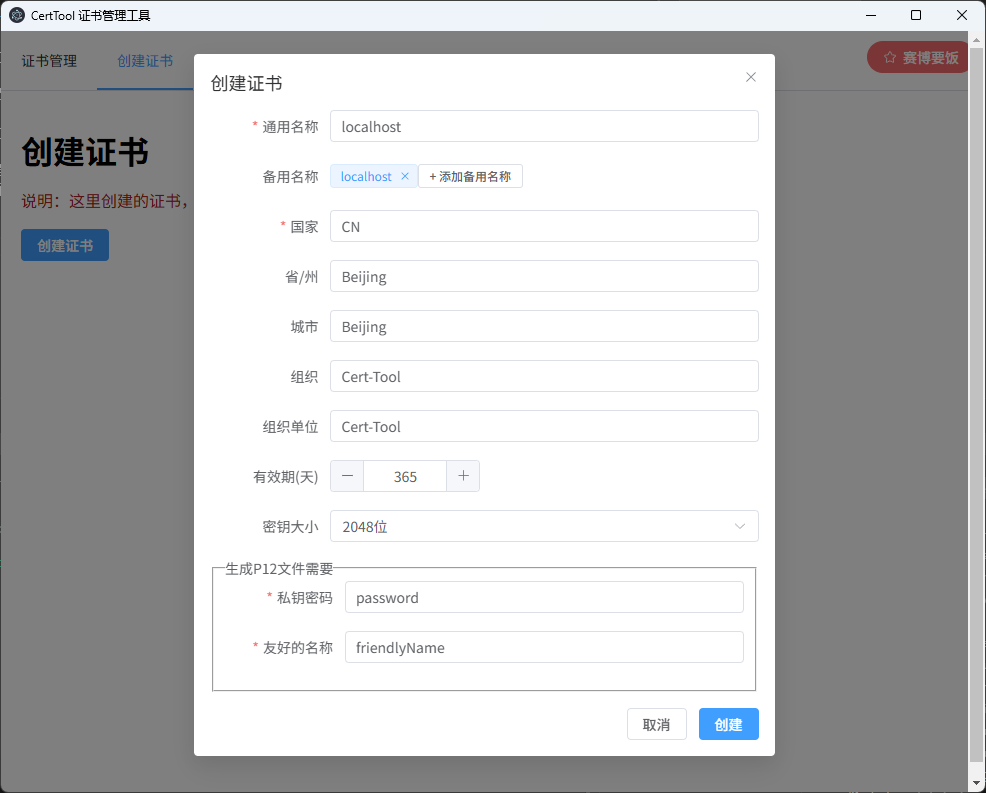
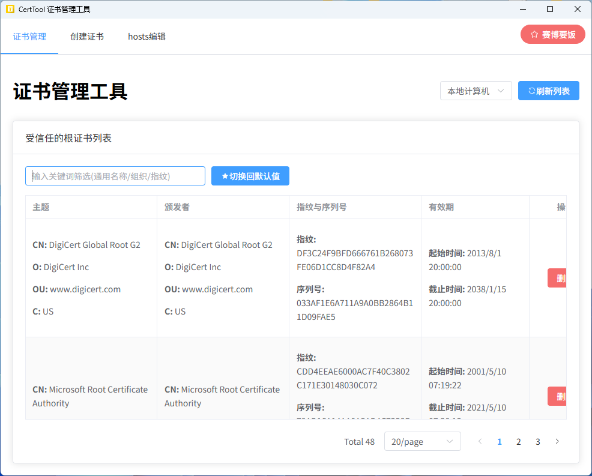
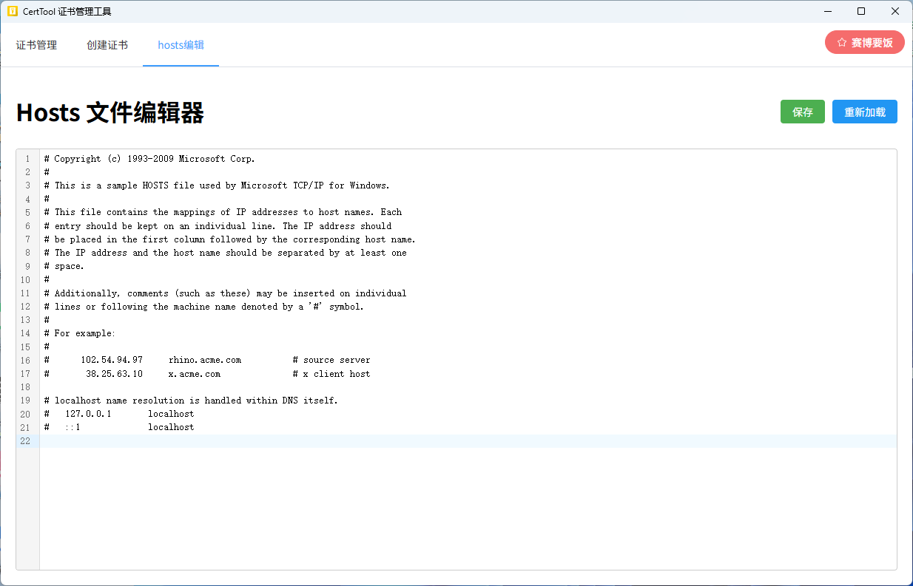

# CertTool：一站式自签证书管理与Hosts编辑工具

## 什么是CertTool？

CertTool是一款专为Windows用户设计的自签名证书管理工具，它提供了"签名生成、信任、编辑hosts，一条龙服务"。无论你是开发人员、测试工程师，还是需要在本地环境配置HTTPS的用户，CertTool都能让你轻松管理证书和hosts文件，无需记忆复杂的命令行指令或深入系统目录。

## 为什么选择CertTool？

### 简化证书管理流程

在开发和测试过程中，我们经常需要创建自签名证书来模拟HTTPS环境。传统方法需要使用OpenSSL等命令行工具，步骤繁琐且容易出错。CertTool提供了直观的图形界面，只需几次点击即可完成证书的创建、导出和信任设置。

### 高效的Hosts文件编辑

作为开发人员，我们经常需要修改hosts文件来映射域名到本地IP。CertTool内置了一个功能强大的hosts编辑器，支持语法高亮、行号显示等功能，让hosts文件编辑变得简单高效，无需手动查找系统目录。

### 一体化解决方案

CertTool将证书管理和hosts编辑功能整合在一起，为本地开发环境配置提供了完整解决方案。创建证书后，可以立即在hosts文件中添加相应的域名映射，一气呵成。

## 主要功能

### 1. 证书创建

- 创建自签名根证书
- 自定义证书信息（通用名称、组织、有效期等）
- 支持添加多个备用名称(SAN)
- 选择密钥大小(2048/4096位)

### 2. 证书管理

- 查看系统中的受信任根证书
- 查找筛选证书列表
- 一键导入证书到信任存储
- 删除不需要的证书
- 导出证书为PKCS12(.pfx/.p12)格式

### 3. Hosts文件编辑

- 直接编辑系统hosts文件
- 语法高亮显示
- 行号显示和代码折叠
- 保存和重新加载

## 使用指南

### 创建自签名证书

1. 打开CertTool，切换到"证书"标签页
2. 填写证书信息：
   - 通用名称（域名或IP地址）
   - 备用名称（可添加多个域名）
   - 国家、省/州、城市、组织等信息
   - 设置有效期（天数）
   - 选择密钥大小
3. 点击"创建证书"按钮
4. 创建成功后，可以：
   - 查看证书详情
   - 导出为PFX/P12文件（需设置密码和友好名称）
   - 一键添加到信任存储（选择"当前用户"或"本地计算机"）

### 管理受信任证书

1. 切换到"证书管理"标签页
2. 选择查看范围（"本地计算机"或"当前用户"）
3. 浏览证书列表，可通过通用名称/组织/指纹进行筛选
4. 选择证书后可查看详情或删除不需要的证书

### 编辑Hosts文件

1. 切换到"Hosts"标签页
2. 在编辑器中直接修改hosts文件内容
3. 点击"保存"按钮应用更改
4. 需要时可点击"重新加载"按钮刷新内容

## 适用场景

- 本地开发环境配置HTTPS
- 内部测试环境的证书管理
- 快速切换不同的开发/测试环境配置
- 管理多个域名到本地IP的映射

## 系统要求

- 操作系统：Windows
- 管理员权限（用于修改系统证书存储和hosts文件）

## 结语

CertTool为Windows开发者提供了一个简单而强大的工具，简化了本地开发环境中证书管理和hosts配置的流程。无需记忆复杂命令，无需手动查找系统目录，只需几次点击即可完成所有操作。如果你经常需要处理自签名证书或修改hosts文件，CertTool将成为你开发工具箱中的得力助手。
